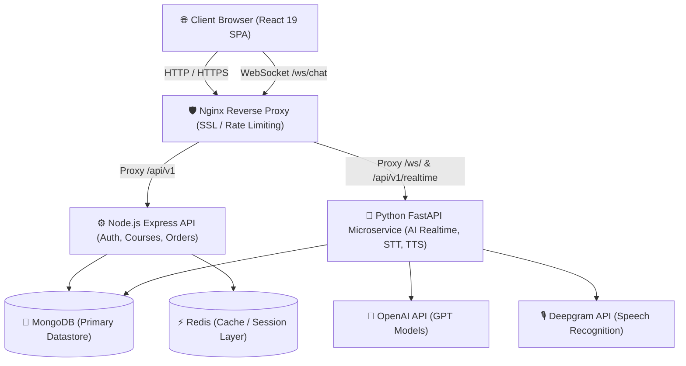

# 🎓 AI-Powered English Learning Platform

[](https://danganhtuong.dev)
[](https://react.dev/)
[](https://nodejs.org/)
[](https://fastapi.tiangolo.com/)
[](https://www.docker.com/)
[](https://www.mongodb.com/)

A modern, production-grade, multi-service AI web application designed for interactive English learning. It combines structured curriculum learning with real-time AI conversational practice, speech-to-text pronunciation evaluation, and vocabulary mindmapping.

🌐 **Live Production App:** [https://danganhtuong.dev](https://danganhtuong.dev)

---

## 🏗️ System Architecture

The platform is engineered using a scalable **Microservices Architecture**:



### Microservice Responsibilities
- **Frontend SPA (`src/`)**: React 19, Redux Toolkit, Ant Design, Axios, and WebSocket client for interactive user sessions.
- **Node.js Express Gateway (`backend/backend-node/`)**: Handles authentication (JWT & Google OAuth2), user profiles, course management, orders, subscriptions, and RBAC.
- **Python FastAPI Microservice (`backend/backend-python/`)**: Powers real-time AI chat, WebSocket streaming (`/ws/chat`, `/ws/voice-chat`), Speech-to-Text (Deepgram SDK), and OpenAI LLM dialogue management.
- **Data & Caching Layer**: MongoDB for persistent data and Redis for fast caching and session coordination.

---

## 🌟 Key Features

### 🎙️ AI Learner Experience
- **Real-Time AI Voice Chat**: Interactive speaking practice with low-latency WebSocket streaming.
- **Speech-to-Text & Pronunciation Feedback**: Automated voice recognition via **Deepgram SDK** and instant grammar/pronunciation scoring using **OpenAI API**.
- **Structured Course Roadmaps**: Interactive course modules, progress tracking, and quiz evaluations.
- **Vocabulary Mindmapping**: Dynamic visual mindmaps generated to reinforce vocabulary retention.

### 🔐 Admin & Governance
- **Role-Based Access Control (RBAC)**: Distinct permissions for Learners, Instructors, and Administrators.
- **Management Dashboards**: Comprehensive analytics for user activity, course performance, and order histories.

---

## 🛠️ Technology Stack

| Layer | Stack |
| :--- | :--- |
| **Frontend** | React 19, React Router v7, Redux Toolkit, Ant Design, Axios |
| **Node Backend** | Node.js, Express, Mongoose, Passport (Google OAuth2), Winston, Joi |
| **Python Backend** | FastAPI, Uvicorn, OpenAI SDK, Deepgram SDK, Motor (Async Mongo) |
| **Databases** | MongoDB, Redis |
| **DevOps & Infra** | Docker, Docker Compose, Nginx, GitHub Actions (CI/CD), Linux Ubuntu VPS |

---

## 🚀 Getting Started

### Prerequisites
- [Docker](https://www.docker.com/) and Docker Compose installed.

### Environment Setup

Create `.env` files in both `backend/backend-node` and `backend/backend-python`:

```bash
# Node Backend (.env)
PORT=3001
MONGODB_URI=mongodb://mongo:27017/english_learning
JWT_SECRET=your_jwt_secret
PYTHON_API_URL=http://backend-python:8000

# Python Backend (.env)
OPENAI_API_KEY=your_openai_key
DEEPGRAM_API_KEY=your_deepgram_key
MONGODB_URL=mongodb://mongo:27017/english_learning
```

### Running with Docker

Run the entire application stack (Frontend, Node API, Python API, MongoDB, Redis) locally:

```bash
docker compose -f docker-compose.dev.yml up -d --build
```

Access services:
- **Frontend App:** `http://localhost:3000`
- **Node.js API:** `http://localhost:3001`
- **Python AI API:** `http://localhost:8000`
- **FastAPI Docs:** `http://localhost:8000/docs`

---

## 🛡️ Production & Deployment Highlights

- **Nginx Reverse Proxy & WebSockets**: Fully configured with `Upgrade` and `Connection` headers for zero-drop WebSocket connections.
- **Zero-Cache SPA Delivery**: Production Nginx forces `Cache-Control: no-store` on `index.html` to prevent stale browser bundle caching.
- **Automated CI/CD**: Pushes to `main` branch trigger automated build and deployment to DigitalOcean VPS via GitHub Actions.

---

## 💻 Author

**Dang Anh Tuong**
- **Website:** [danganhtuong.dev](https://danganhtuong.dev)
- **GitHub:** [@DangAnhTuong](https://github.com/DangAnhTuong)
- **Email:** danganhtuongg@gmail.com

---
*Built with ❤️ using React 19, Node.js, FastAPI & Docker.*
