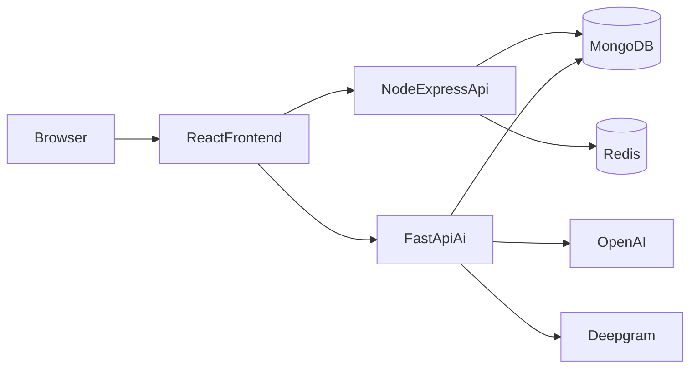

# English Learning Platform

Nền tảng học tiếng Anh full-stack với kiến trúc nhiều service: web app cho người học/admin, backend nghiệp vụ Node.js, backend AI Python realtime, kèm Docker stack production-ready.

## Table Of Contents

- [1. Project Scope](#1-project-scope)
- [2. System Architecture](#2-system-architecture)
- [3. Technology Stack](#3-technology-stack)
- [4. Repository Structure](#4-repository-structure)
- [5. Core Features](#5-core-features)
- [6. Routing And API Surface](#6-routing-and-api-surface)
- [7. Environment Configuration](#7-environment-configuration)
- [8. Run Without Docker](#8-run-without-docker)
- [9. Run With Docker](#9-run-with-docker)
- [10. Verification Checklist](#10-verification-checklist)
- [11. Scripts And Utilities](#11-scripts-and-utilities)
- [12. Security And Production Notes](#12-security-and-production-notes)
- [13. Troubleshooting](#13-troubleshooting)

## 1. Project Scope

Hệ thống phục vụ:

- Học tiếng Anh theo lộ trình (courses, profile, progress)
- Luyện hội thoại theo chủ đề/cấp độ có audio
- AI chat realtime, chuyển giọng nói thành văn bản, phản hồi phát âm
- Quản trị user/content/course từ admin panel

Hệ thống hiện chạy ổn theo mô hình:

- Frontend: `http://localhost` (nginx trong Docker prod)
- Node API: `http://localhost:3001`
- Python API: `http://localhost:8000`

## 2. System Architecture



### Service Responsibilities

- `Frontend` (`src/`)
  - UI public/private/admin
  - Auth token handling + refresh token flow
  - Calls both Node API and Python API
- `Backend Node` (`backend/backend-node/`)
  - Business APIs: auth, profile, courses, conversations, orders, subscriptions, vocabulary, levels, admin
  - RBAC (roles/permissions), validation, logging
  - Coordinates with Python AI backend through `PYTHON_API_URL`
- `Backend Python` (`backend/backend-python/`)
  - AI endpoints: realtime chat, whisper, pronunciation feedback, tts/deepgram
  - WebSocket channels (`/ws/chat`, `/ws/voice-chat`)
  - MongoDB connection via Motor
- `MongoDB`
  - Persistent primary datastore
- `Redis`
  - Cache/service integration layer (ready for scale extensions)

## 3. Technology Stack

| Layer | Stack |
| --- | --- |
| Frontend | React 19, React Router, Redux Toolkit, Ant Design, Axios, CRA |
| Node Backend | Node.js, Express, Mongoose, Joi, Passport Google OAuth, Winston |
| Python Backend | FastAPI, Uvicorn/Gunicorn, OpenAI SDK, Deepgram SDK, Motor |
| Infra | Docker Compose, Nginx, MongoDB, Redis |

## 4. Repository Structure

```text
web_learn_english/
├─ src/                                # React frontend
│  ├─ page/                            # Screens (home, courses, conversation, admin, ...)
│  ├─ services/                        # API clients (Node + Python)
│  ├─ routes/                          # Client routes
│  └─ redux/
├─ backend/
│  ├─ backend-node/
│  │  ├─ src/
│  │  │  ├─ routes/
│  │  │  ├─ controllers/
│  │  │  ├─ services/
│  │  │  ├─ models/
│  │  │  └─ middlewares/
│  │  ├─ scripts/
│  │  └─ Dockerfile
│  └─ backend-python/
│     ├─ app/
│     │  ├─ api/v1/
│     │  ├─ services/
│     │  └─ core/
│     ├─ requirements.txt
│     └─ Dockerfile
├─ docker-compose.dev.yml
├─ docker-compose.prod.yml
├─ Dockerfile                          # Frontend prod image
├─ Dockerfile.dev                      # Frontend dev image
├─ docker/nginx/frontend.conf          # Nginx reverse proxy for frontend image
└─ README.md
```

## 5. Core Features

### Learner Features

- Register/login/logout
- Profile management
- Conversation practice with topics/levels/audio
- Mindmap vocabulary support
- AI chatbox with voice workflows
- Public courses and course details
- My enrolled courses

### Admin Features

- Admin dashboard
- User management
- Teacher modules management
- Context management (plans/topics)
- Course management
- Order management

### AI Features (Python)

- Realtime chat (`/api/v1/realtime/chat`)
- Whisper transcription (`/api/v1/realtime/whisper`)
- Pronunciation feedback (`/api/v1/realtime/feedback`)
- TTS and Deepgram endpoints
- Websocket channels for realtime interaction

## 6. Routing And API Surface

### Frontend Routes (selected)

- Public:
  - `/`
  - `/courses`
  - `/courses/:courseId`
  - `/faq`, `/contact`, `/about`, `/privacy-policy`, `/terms-of-service`
- Private:
  - `/conversation`
  - `/mindmap`
  - `/profile`
  - `/chatbox`
  - `/my-courses`
- Auth callbacks:
  - `/verify-email`
  - `/auth/callback`
  - `/api/v1/auth/google/callback` (frontend proxy route)
- Admin:
  - `/admin/dashboard`
  - `/admin/users`
  - `/admin/teacher-modules`
  - `/admin/context`
  - `/admin/courses`
  - `/admin/orders`

### Node API Groups (`/api/v1`)

- `/auth`
- `/profile`
- `/courses`
- `/conversations`
- `/orders`
- `/subscriptions`
- `/vocabulary`
- `/levels`
- `/admin/users`
- `/admin`

### Python API Groups

- `/api/v1/realtime/*`
- `/api/v1/tts/*`
- `/api/v1/deepgram/*`
- `/api/v1/mindmap/*`
- `/api/v1/conversation/*`
- `/health`
- `/api/status`
- WebSocket:
  - `/ws/chat`
  - `/ws/voice-chat`

## 7. Environment Configuration

## Frontend

- `REACT_APP_API_URL` (default `http://localhost:3001/api/v1`)
- `REACT_APP_PYTHON_API_URL` (default `http://localhost:8000`)
- `REACT_APP_WS_URL` (optional)

## Node Backend

- `PORT` (default `3001`)
- `MONGO_URI`
- `JWT_SECRET`
- `REFRESH_SECRET` or `JWT_REFRESH_SECRET`
- `GOOGLE_CLIENT_ID`, `GOOGLE_CLIENT_SECRET`, `GOOGLE_CALLBACK_URL`
- `SMTP_HOST`, `SMTP_PORT`, `SMTP_USER`, `SMTP_PASS`
- `CORS_ALLOWLIST`
- `PYTHON_API_URL`
- `REQUIRE_COURSE_CONTENT_FOR_PUBLISH`

## Python Backend

- `HOST`, `PORT` (default `0.0.0.0:8000`)
- `MONGODB_URL`
- `DATABASE_NAME`
- `OPENAI_API_KEY` (required for AI runtime)
- `DEEPGRAM_API_KEY`
- `ALLOWED_ORIGINS`
- `DEBUG`, `LOG_LEVEL`

## 8. Run Without Docker

### Prerequisites

- Node.js LTS + npm
- Python 3.11 recommended
- MongoDB running
- Redis optional but recommended

### Frontend (Local)

```bash
npm install
npm start
```

Frontend URL: `http://localhost:3000`

### Node Backend (Local)

```bash
cd backend/backend-node
npm install
npm run dev
```

Node URL: `http://localhost:3001`

### Python Backend (Local)

```bash
cd backend/backend-python
python -m venv .venv
.venv\Scripts\activate
pip install -r requirements.txt
uvicorn app.main:app --reload --host 127.0.0.1 --port 8000
```

Python URL: `http://localhost:8000`

## 9. Run With Docker

### Important

Docker compose currently mounts existing env files directly:

- `backend/backend-node/.env` -> `/app/.env`
- `backend/backend-python/.env` -> `/app/.env`

So you should maintain these two files as the source of truth.

### Development Stack

```bash
docker compose -f docker-compose.dev.yml up -d
docker compose -f docker-compose.dev.yml ps
```

First run or after Dockerfile changes:

```bash
docker compose -f docker-compose.dev.yml up -d --build
```

Stop:

```bash
docker compose -f docker-compose.dev.yml down
```

### Production Stack

```bash
docker compose -f docker-compose.prod.yml up -d --build
```

Stop:

```bash
docker compose -f docker-compose.prod.yml down
```

### Create Admin Account

After services are up and MongoDB is healthy, create or promote an admin account:

For development stack:

```bash
docker exec -e ADMIN_EMAIL=admin@yourdomain.com -e ADMIN_PASSWORD=YourStrongPassword123! -e ADMIN_NAME="System Admin" -it wle-backend-node-dev node scripts/create-admin.js
```

For production stack:

```bash
docker exec -e ADMIN_EMAIL=admin@yourdomain.com -e ADMIN_PASSWORD=YourStrongPassword123! -e ADMIN_NAME="System Admin" -it wle-backend-node-prod node scripts/create-admin.js
```

Local Node backend (without Docker):

```bash
cd backend/backend-node
node scripts/create-admin.js
```

Script behavior:

- Creates a new admin if email does not exist.
- Promotes existing user to `admin` if found by email.
- Marks admin as active and email-verified.

## 10. Verification Checklist

### Status and Logs

```bash
docker compose -f docker-compose.prod.yml ps
docker compose -f docker-compose.prod.yml logs backend-node --tail=100
docker compose -f docker-compose.prod.yml logs backend-python --tail=100
docker compose -f docker-compose.prod.yml logs frontend --tail=100
```

### Health Endpoints

- Frontend: `http://localhost`
- Node: `http://localhost:3001/health`
- Python: `http://localhost:8000/health`
- Node via frontend proxy: `http://localhost/api/v1/levels`
- Python via frontend proxy: `http://localhost/python-api/health`

## 11. Scripts And Utilities

### Frontend (`package.json`)

- `npm start`
- `npm run build`
- `npm test`

### Backend Node (`backend/backend-node/package.json`)

- `npm start`
- `npm run dev`
- `npm test`

### Useful Backend Node Scripts (`backend/backend-node/scripts`)

- `seed-demo-courses.js`
- `test-hardening-sync.js`
- `test-login.js`

## 12. Security And Production Notes

- Never commit real secrets.
- Rotate secrets immediately if exposed in logs/screenshots/chat.
- Prefer exposing only reverse proxy ports (`80/443`) on public environments.
- Enable TLS/HTTPS for internet deployment.
- Backup MongoDB and Redis volumes periodically.
- Keep `REQUIRE_COURSE_CONTENT_FOR_PUBLISH=true` for strict production publishing.
- Note: Node JWT refresh logic supports both `REFRESH_SECRET` and `JWT_REFRESH_SECRET`.

## 13. Troubleshooting

### Backend Node keeps restarting in Docker

```bash
docker compose -f docker-compose.prod.yml logs backend-node --tail=200
```

Then verify Node `.env` has valid values for JWT/SMTP/OAuth and `MONGO_URI`.

### Python fails with `OPENAI_API_KEY not found`

Add key in `backend/backend-python/.env`, then:

```bash
docker compose -f docker-compose.prod.yml up -d --build backend-python
```

### Frontend cannot call APIs

Verify:

- Local vars (`REACT_APP_API_URL`, `REACT_APP_PYTHON_API_URL`)
- Docker nginx proxy paths:
  - `/api/v1` -> Node backend
  - `/python-api` -> Python backend

### Reset Docker volumes (destructive)

```bash
docker compose -f docker-compose.prod.yml down -v
docker compose -f docker-compose.dev.yml down -v
```

---

Project ownership: internal English learning platform development and deployment.
